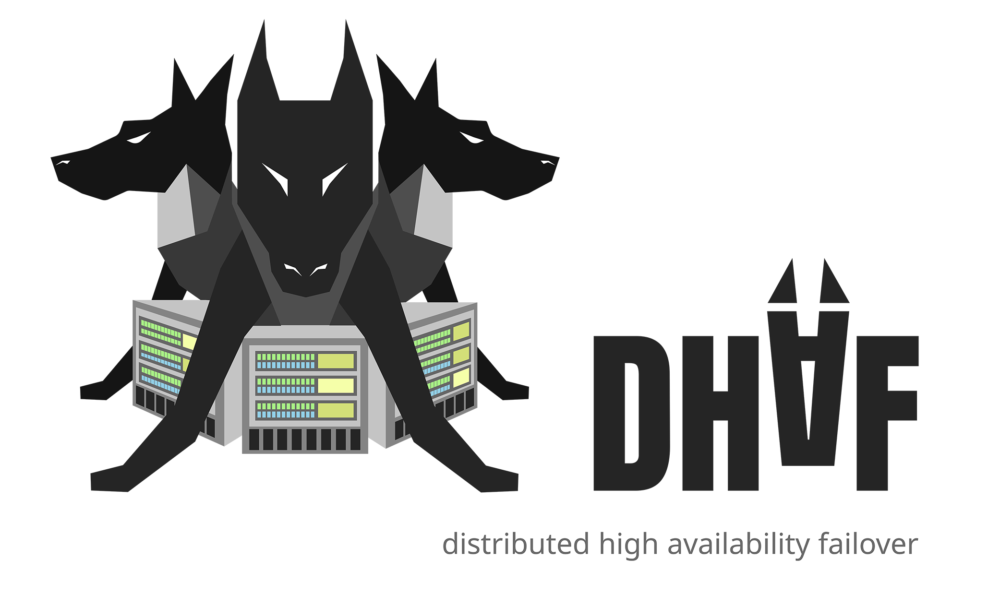

# Dhaf
Distributed high availability failover, written in cross-platform C# [.NET](https://github.com/dotnet) (Linux, Windows and macOS supported).


# Why is it useful? 🚀
Dhaf is a system that keeps your web service **always online** for the end user. It's available to everyone for free and without the need for special knowledge or complicated network infrastructure.

Dhaf has switchers - various providers to manage network configurations (more on this below), health checkers and notifiers.
It is extremely flexible, extensible and easy to use and configure.

To avoid bogging you down with details right away, let's take a look at one of the great use cases below.

One of the switchers implemented in Dhaf is the Cloudflare provider. This company [guarantees](https://www.cloudflare.com/dns/) the following for **free**:
> Our authoritative DNS is the fastest in the world, offering DNS lookup speed of 11ms on average and worldwide DNS propagation in less than 5 seconds.

Thus, this mechanism can be used to avoid a single point of failure ([SPoF](https://en.wikipedia.org/wiki/Single_point_of_failure)) of your network service (website, etc.). This is completely legal and in accordance with Cloudflare rules (using their official API).
Also a bonus are important security features: protection from DDoS and hiding the real IP of your servers.

# Who is it suitable for?
This solution is perfect for small and medium-sized projects that are not ready to spend huge resources (including financial) to maintain high availability of their services. If you want to provide HA fast and simple then this solution is for you.

# What major features does dhaf have?
- Failover (dhaf will automatically and transparently switch your servers to end clients if necessary);
- Switchover (manually switching your servers) — useful for debugging and performing server maintenance invisibly to the end client;
- Support for several different services in one dhaf cluster (which may "located" in subdomains of your domain name, for example);
- Flexible notifier providers. Notifications are already available for:
    - Email
    - Telegram Messenger
- Flexible customization of the health checks of your service;
- All user configuration in YAML format;
- Only you decide from where to check the availability of your services;
- User-friendly CLI for check and manage your dhaf cluster;
- REST API for check and manage your dhaf cluster;
- Feature to easily create your own providers for switchers, health checkers and notifiers in C#;
- Feature to connect own executable scripts (e.g., in Python) as switchers and health checkers;
- High availability and distribution due to the fact that dhaf is a cluster.

# Prerequisites
The following is recommended for stable operation of this solution:
1. Two servers of your entry point (primary, secondary) in independent data centers. This can be both load balancers (such as haproxy) and directly your services;
2. Three dhaf servers in independent datacenters. These can be the **cheapest** virtual servers (including cloud servers), because the load on them is minimal. The following should be installed on them:
    - **dhaf** (current project);
    - **[etcd](https://github.com/etcd-io/etcd)** >= v3.5 as DCS (Distributed Configuration Store);
    -  .NET Runtime >= 5.0 (download [here](https://dotnet.microsoft.com/download/dotnet/5.0/runtime)).

# Quick Start
Below is a simple example of how to make dhaf work (with Cloudflare provider as switcher).
1. Suppose you have two similar servers in different data centers, which both provide your web-service. They have the following IP addresses: 111.111.111.11 (primary) and 222.222.222.222 (secondary);
2. Let us also assume that you have prepared three dhaf servers in different datacenters. They have the following IP addresses: 111.1.1.1, 112.2.2.2, 113.3.3.3;
3. Install and start etcd on all the dhaf servers (if you have not already done so). See details [here](https://etcd.io/docs/v3.5/quickstart/) and [here](https://etcd.io/docs/v3.5/op-guide/clustering/);
4. Build dhaf (requires .NET >= 5.0) from sources or use our builds;
5. Create a Cloudflare account with a free plan (this will be enough). Transfer there DNS management for your domain name `foo.com`. Also note that your domain name must have only one A record in the DNS that has the Clouflare proxying checkbox checked. Otherwise, you will get [round-robin](https://en.wikipedia.org/wiki/Round-robin_DNS) detrimental for our purposes and/or unacceptably slow updating of DNS records for end clients;
    - ⚠️ Warning! To combat scammers, Cloudflare does not allow DNS configuration via the official API for domains with a .cf, .ga, .gq, .ml, or .tk TLD (top-level domain). Thus, it is not possible to work with them in **dhaf** either. However, it is still possible to manually configure them in Cloudflare Dashboard.
6. Using the Clouflare dashboard, [create](https://dash.cloudflare.com/profile/api-tokens) an API token (if you have not already done so) with access to edit the DNS records of your domain zone. You also need to set an adequate TTL (lifetime) of your token, and keep it up to date.
7. For the **first** dhaf node, сreate a configuration file `config-n1.dhaf`, which has the following contents:
```yaml
dhaf:
  cluster-name: first-dhaf-cluster
  node-name: node-1

etcd:
  hosts: http://111.1.1.1:2379,http://112.2.2.2:2379,http://113.3.3.3:2379

services:
  - name: main
    domain: foo.com
    network-conf:
      - name: nc-1
        ip: 111.111.111.11
      - name: nc-2
        ip: 222.222.222.222
    switcher:
      type: cloudflare
      api-token: <your_api_token>
      zone: foo.com
    health-checker:
      type: web
      schema: http
```
8. As you can see from the value of the `dhaf.node-name` parameter of the configuration file above, it is intended for the first dhaf node. Create two more of these, replacing the value of the parameter `dhaf.node-name` with `node-2` and `node-3` respectively (as well as the name of the config so as not to get confused.);
9. The only thing left to do is to run dhaf on all dhaf servers (don't forget to substitute the appropriate configuration file):
```shell
./dhaf.node --config config-n1.dhaf
```
10. After the dhaf cluster is fully initialized, you can see its status via CLI:
```shell
./dhaf.cli status-services --config config-n1.dhaf
```
11. Congratulations! Everything works. And now you can test failures of your servers as an experiment.

# Available CLI commands:
- `./dhaf.cli status-dhaf --config <config_file>` - show dhaf cluster status information.
- `./dhaf.cli status-service --service <service_name> --config <config_file>` - show service status information.
- `./dhaf.cli status-service --config <config_file>` - show all services status information.
- `./dhaf.cli switchover-candidates --service <service_name> --config <config_file>` - show suitable network configurations for switchover.
- `./dhaf.cli switchover-to <nc> --service <service_name> --config <config_file>` - switchover to the `<nc>` network configuration.
- `./dhaf.cli switchover-purge --config <config_file>` - purge the switchover requirement.
- `./dhaf.cli node-decommission <node_name> -config <config_file>` - decommission the dhaf node `<node_name>`.
- `./dhaf.cli help` - display more information on a specific command.
- `./dhaf.cli version` - display version information.

# Available REST API endpoints:
Similar functionality to the CLI (because the CLI uses the REST API). Detailed documentation is in development, for now you can see [here](https://github.com/hyperion-cs/dhaf/blob/main/src/Dhaf.Node/RestApi/RestApiController.cs).

# Available providers (core extensions)
|Type|Name|Description|
| :-: | :-: | - |
| switcher | cloudflare | Performs network configuration switching by quickly changing Cloudflare DNS records. |
| switcher | exec | Switching the network configuration via an executable file (e.g. a Python script). |
| health checker | web | Checks the health of the http(s) service. |
| health checker | exec | Checks the health of service via an executable file (e.g. a Python script). |
| notifier | email | Email notifications from dhaf. |
| notifier | tg | Telegram messenger notifications from dhaf. |

Need another extension? Leave a [feature request](https://github.com/hyperion-cs/dhaf/issues).

# Configuration file
### Major part (required)
|Parameter name|Type|Description|
| - | :-: | - |
| `dhaf.cluster-name` | string | Dhaf cluster-name. Only the characters `a-zA-Z0-9`, `-` (hyphen) and `_` are allowed. |
| `dhaf.node-name` | string | The name of the current dhaf cluster node. Only the characters `a-zA-Z0-9`, `-` (hyphen) and `_` are allowed. |
| `etcd.hosts` | string | Etcd hosts in the format `ip1:port1,ip2:port2,...,ipN:portN`. |
| `services` | list | The list of services that dhaf will keep available. |
| `services.name` | string | The name of the service. Only the characters `a-zA-Z0-9`, `-` (hyphen) and `_` are allowed. |
| `services.domain` | string | Domain name for service <name>. For example, `site.com`. |
| `services.network-conf` | object | List of network configurations for service <name> in **order** of priority. |
| `services.network-conf.name` | string | The name of the network configuration. Only the characters `a-zA-Z0-9`, `-` (hyphen) and `_` are allowed. |
| `services.network-conf.ip` | string | The IP address of the network configuration <name>. |
| `services.switcher` | object | Switcher for service <name>. |
| `services.switcher.type` | object | Name (provider type) of switcher for service <name>. |
| `services.health-checker` | object | Health checker for service <name>. |
| `services.health-checker.type` | object | Name (provider type) of health checker for service <name>. |
   
### Optional
|Parameter name|Type|Description|Default|
| - | :-: | - | :-: |
| `dhaf.healthy-node-status-ttl` | string | For how long the dhaf node is considered healthy after the last heartbeat. | `30` |
| `dhaf.heartbeat-interval` | string | Frequency of sending heartbeat of node dhaf to distributed storage (dcs). | `5` |
| `dhaf.tact-interval` | string | How often the dhaf should perform checks (in seconds). It is counted after the completion of the last check. Must be in the range 1-3600 seconds. | `10` |
| `dhaf.web-api` | string | REST API configuration for the dhaf node. | — |
| `dhaf.web-api.host` | string | REST API Host. | `localhost` |
| `dhaf.web-api.port` | int | Rest API Port | `8128` |

### Configurations for switchers providers
    
Cloudflare switcher provider (`cloudflare`):
|Parameter name|Type|Description|Default|
| - | :-: | - | :-: |
| `api-token` | string | API token for managing your DNS records in Cloudflare. | Required |
| `zone` | string | Zone for managing your DNS records in Cloudflare. | Required |
    
Exec switcher provider (`exec`):
|Parameter name|Type|Description|Default|
| - | :-: | - | :-: |
| `init` | string | Path to the executable file for provider initialization. | Required |
| `switch` | string | Path to the executable file to switch. The command line arguments for switching will be passed: [network configuration name, network configuration ip].| Required |
    
### Configurations for health check providers

Web health check provider (`web`):
|Parameter name|Type|Description|Default|
| - | :-: | - | :-: |
| `schema` | string | Uri schema. Now `http` and `https` are available. | `http` |
| `method` | string | HTTP method that the checker uses. Now `GET` and `POST` are available. | `GET` |
| `port` | int | The port to health check against. | `80` (http), `443` (https) |
| `path` | string | The endpoint path to health check against. | `/` |
| `headers` | dict | Http headers in key-value format. | — |
| `follow-redirects` | bool | Is it necessary to follow redirects? | `false` |
| `timeout` | int | Timeout (in seconds) for connecting to the host to be checked. Must be in the range 1-86400 seconds. | `5` |
| `retries` | int | The number of retries to attempt in case of a timeout before marking the origin as unhealthy. Retries are attempted immediately. | `2` |
| `expected-codes` | string | The expected HTTP response code or code range of the health check in the format `111,222,3XX`. It is allowed to use X as a wildcard (e.g.: 2XX). Must indicate valid HTTP response code(s). | `200` |
| `expected-response-body` | string | A case insensitive sub-string to look for in the response body. If this string is not found, the server will be marked as unhealthy. | — |
| `domain-forwarding` | bool | Automatically forward the domain name of the service (`services.domain` parameter) to the `Host` header for each HTTP request. If the `Host` header is specified manually (via `headers` parameter), there will be **no forwarding** even if the current parameter is set to `true`. | `true` |
| `ignore-ssl-errors` | bool | Ignore SSL certificate validation errors (applies to `HTTPS` schema only). | `false` |
    
Exec health check provider (`exec`):
|Parameter name|Type|Description|Default|
| - | :-: | - | :-: |
| `init` | string | Path to the executable file for provider initialization. | Required |
| `check` | string | Path to the executable file to health check. The command line arguments for health check will be passed: [network configuration name, network configuration ip]. Should return exit code 0 if the network configuration is considered healthy. | Required |
    
### Configurations for notifier providers
⚠️ Pay attention! There can be several of them in one cluster.
    
E-Mail notifier provider (`email`):
|Parameter name|Type|Description|Default|
| - | :-: | - | :-: |
| name | string | Notifier instance name. | `email-anon` |
| from | string | The email address of the sender of the notifications. | Required |
| to | string | The email address of the recipient of the notifications. | Required |
| smtp | object | SMTP server configuration. | — |
| smtp.server | string | SMTP server host. | Required |
| smtp.port | int | SMTP server port. | Required |
| smtp.security | string | Connection security. Possible values: `ssl`. | — |
| smtp.username | string | SMTP server credentials -> username. | — |
| smtp.password | string | SMTP server credentials -> password. | — |
    
Telegram messenger notifier provider (`tg`):
|Parameter name|Type|Description|Default|
| - | :-: | - | :-: |
| name | string | Notifier instance name. | `tg-anon` |
| token | string | API token from Telegram bot. | Required |
| join-code | string | The security code that is required to start a notification bot in private messages or a group. | Required |
  
Telegram bot prerequisites:
- All you have to do is create a bot via @BotFather (more details [here](https://core.telegram.org/bots#3-how-do-i-create-a-bot)) and write the API key in the config. Everything else is taken care of by the `tg` provider (in other words, the `tg` provider acts as a server for the bot). It does NOT require incoming connections because it uses [long polling](https://en.wikipedia.org/wiki/Push_technology#Long_polling);
- It is worth turning on [privacy mode](https://core.telegram.org/bots#privacy-mode) in the settings of the bot.
    
# Dhaf as a service, automatically started at OS startup
This is done e.g. via [Systemd](https://en.wikipedia.org/wiki/Systemd) on Linux. For Windows you can use [Windows service](https://en.wikipedia.org/wiki/Windows_service).
The templates can be found in the `templates` folder of the current repository.
    
# Terminology
- Failover — emergency switching of the network configuration in automatic mode;
- Switchover — knowingly manually switching network configurations (for maintenance, testing, etc.);
- Switching — automatically switching of the network configuration to the higher priority of the healthy ones.
    
